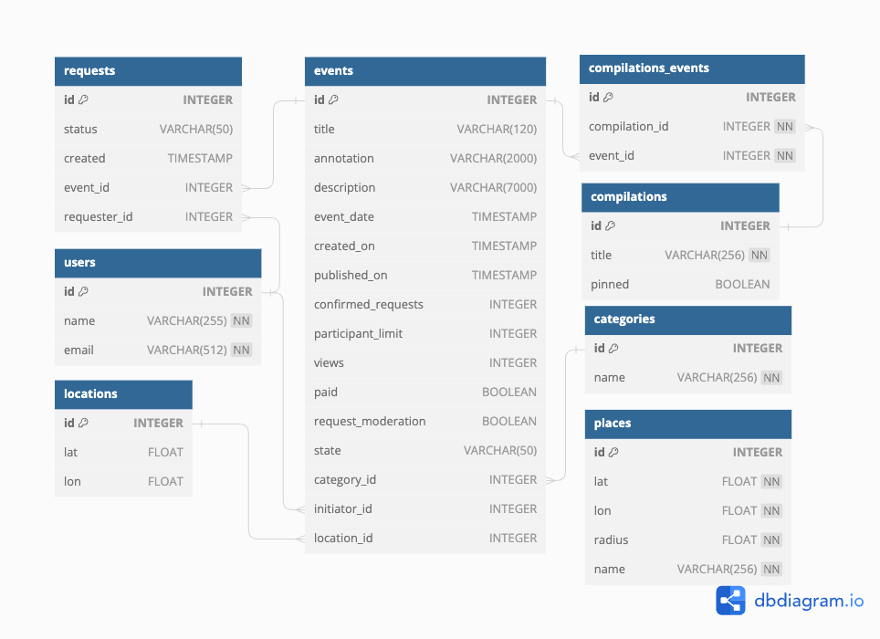

# java-explore-with-me

Приложение представляет собой бекэнд афиши. С помощью него пользователи могут делиться информацией об интересных событиях и находить компанию для участия в них. 
Состоит из 2-х сервисов:
- основной сервис с событиями;
- сервис статистики просмотров событий;

## **Cервис статистики**
**Cервис статистики** собирает информацию:
- о количестве обращений пользователей к спискам событий и
- о количестве запросов к подробной информации о событии.

Функционал **сервиса статистики** поддерживает:
- запись информации о том, что был обработан запрос к эндпоинту API;
- предоставление статистики за выбранные даты по выбранному эндпоинту.

## **Основной сервис** 
**Основной сервис** делится на три части:
- _публичная_ доступна без регистрации любому пользователю сети;
- _закрытая_ доступна только авторизованным пользователям;
- _административная_ - для администраторов сервиса.

_Публичный API_ предназначен для поиска и фильтрации событий. При просмотре списка событий предоставляется краткая информация о мероприятиях, отсортированных либо по количеству просмотров из сервиса статистики, либо по датам событий. При просмотре данных конкретного события предоставляется полная информация о нем. Каждый запрос для получения списка событий или информации по опеделенному событию фиксируется сервисом статистики. События относятся к определенной категории. Данные по категориям так же доступны в публичном доступе. События могут быть включены администратором в подборку мероприятий. Публично доступен просмотр подборок событий.

_API для авторизованных пользователей_ поддерживает возможность добавлять в приложение новые мероприятия, редактировать их и просматривать после добавления. Авторизоанный пользователь может подать заявку на участие в событии. В свою очередь пользователь-создатель мероприятия может подтверждать/отклонять заявки других пользователей.

_API для администраторов_ предназначено для настройки и поддержки работы сервиса. Администратору доступно: 
- управление пользователями - добавление, просмотр и удаление;
- управление категориями событий - добавление, изменение и удаление;
- упраление подборками мероприятий - добавление, удаление, закрепление на главной странице;
- управление локациями - добавление, удаление, просмотр;
- модерация событий - публикация/отклонение;
- просмотр событий, попадающих в определенную локацию (по номеру или наименованию).

## **Схема базы данных** 

## _Технологии проекта_
> Spring Boot 2.7.5 
> Spring Data JPA, Hibernate 
> JDBC Template 
> Java version 11 
> PostrgeSQL 14 
> Docker-compose 
